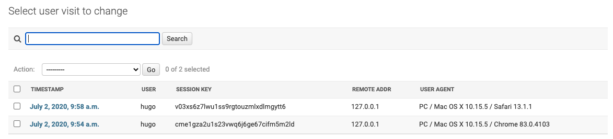
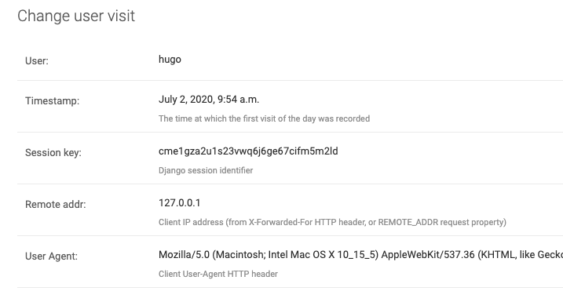

# django-user-visit

Django app for recording daily user visits

#### Compatibility

This library uses the `__future__.annotations` import for postponed evaluation of annotations.
As a result it supports Python 3.7 and above only.

It supports Django 2.2 and above.

---

This app consists of middleware to record user visits, and a single `UserVisit` model to capture
that data.

The principal behind this is _not_ to record every single request made by a user. It is to record
each daily visit to a site.

The one additional factor is that it will record a single daily visit per session / device / ip
combination. This means that if a user visits a site multiple times from the same location / same
device, without logging out, then they will be recorded once. If the same user logs in from a
different device, IP address, then they will be recorded again.

The goal is to record unique daily visits per user 'context' ( where context is the location /
device combo).

Admin list view:

Admin edit view:

